# Financial Time Series Forecasting with Deep Learning and Social Media Sentiment

Clean, reproducible pipelines for forecasting stock prices using ARIMA, Google TimesFM, Amazon Chronos, and Temporal Fusion Transformer (TFT), with optional Reddit sentiment and activity features.

## 🚀 Quickstart

### Pipeline Overview


### Prerequisites

1. **Install dependencies**
```bash
pip install -r requirements.txt
```

2. **Set up Reddit API credentials** (optional - only needed for data extraction)
Create a `.env` file with your Reddit API credentials:
```
REDDIT_CLIENT_ID=your_client_id
REDDIT_CLIENT_SECRET=your_client_secret
REDDIT_USER_AGENT=your_user_agent
```

### Running the Models

The project includes processed datasets for **TSLA** and **NVDA**. You can run the models directly using the notebooks:

#### TSLA Models
- `notebooks/0_arima_baseline.ipynb` - ARIMA baseline
- `notebooks/1_timesfm_baseline.ipynb` - Google TimesFM baseline
- `notebooks/2_chronos_baseline.ipynb` - Amazon Chronos baseline
- `notebooks/3_tft_baseline_runner.ipynb` - TFT baseline (price features only)
- `notebooks/4_tft_with_reddit_sentiment_runner.ipynb` - TFT with Reddit sentiment

#### NVDA Models
- `notebooks/0_arima_baseline_nvda.ipynb` - ARIMA baseline
- `notebooks/1_timesfm_baseline_nvda.ipynb` - Google TimesFM baseline
- `notebooks/2_chronos_baseline_nvda.ipynb` - Amazon Chronos baseline
- `notebooks/3_tft_baseline_runner_nvda.ipynb` - TFT baseline (price features only)
- `notebooks/4_tft_with_reddit_sentiment_runner_nvda.ipynb` - TFT with Reddit sentiment

#### Additional Analysis Notebooks
- `notebooks/5_volume_normalization_experiment.ipynb` - Volume normalization experiments
- `notebooks/6_neutral_sentiment_ab_test.ipynb` - Sentiment analysis A/B testing
- `notebooks/activity_timing_spike_detection.ipynb` - Reddit activity spike detection
- `notebooks/wordcloud_analysis.ipynb` - Keyword analysis and word clouds
- `notebooks/sentiment_analysis.ipynb` - Sentiment model benchmarking

### Usage Instructions

1. Open any notebook from the `notebooks/` directory
2. When prompted, enter a `training_start_date` within the available range
3. Default settings:
   - Context window: 96 trading days
   - Forecast horizon: 5 trading days
4. Run all cells to train and generate forecasts
5. Results are automatically saved to `results/` directory

## 📊 Results Summary

### TSLA Performance Results

| Model         |   MAE |    MSE |  RMSE | MAPE |   DA |
|---------------|------:|-------:|------:|-----:|-----:|
| ARIMA         | 16.27 | 343.83 | 18.54 | 4.74 | 1.00 |
| TimesFM       | 18.32 | 392.21 | 19.80 | 5.35 | 0.00 |
| Chronos       |  7.10 |  70.67 |  8.41 | 4.59 | 0.00 |
| TFT_baseline  |  5.20 |  29.72 |  5.45 | 1.55 | 1.00 |
| **TFT_Reddit**| **3.00** | **10.61** | **3.26** | **0.89** | **1.00** |

### NVDA Performance Results

| Model         |  MAE |   MSE |  RMSE | MAPE |   DA |
|---------------|-----:|------:|------:|-----:|-----:|
| ARIMA         | 4.97 | 43.68 |  6.61 | 3.26 | 0.00 |
| TimesFM       | 6.82 | 68.19 |  8.26 | 4.50 | 0.00 |
| Chronos       | 7.10 | 70.67 |  8.41 | 4.59 | 0.00 |
| TFT_baseline  | 14.21|206.40 | 14.37 | 9.36 | 0.00 |
| **TFT_Reddit**| **1.57** | **3.02** | **1.74** | **1.04** | **1.00** |

### Key Insights

- **Winner**: TFT_Reddit (TFT + Reddit sentiment & spike features) achieves the best performance on both stocks
- **Directional Accuracy**: TFT_Reddit achieves perfect DA (≈1.0) on both TSLA and NVDA
- **Cross-Stock Performance**: TFT_Reddit delivers very low errors with high directional accuracy across different stocks

## 📈 Sentiment-Enhanced TFT Improvement Analysis

### Performance Improvement Metrics

| Model | TSLA RMSE | ΔRMSE vs Baseline | TSLA MAPE | ΔMAPE vs Baseline | NVDA RMSE | ΔRMSE vs Baseline | NVDA MAPE | ΔMAPE vs Baseline |
|:------|-----------:|------------------:|-----------:|------------------:|-----------:|------------------:|-----------:|------------------:|
| **TFT_baseline** | 5.45 | — | 1.55 | — | 14.37 | — | 9.36 | — |
| **TFT_Reddit** | **3.26** | **−40.2%** | **0.89** | **−42.6%** | **1.74** | **−87.9%** | **1.04** | **−88.9%** |

### Key Insights

- **Sentiment integration** dramatically reduces forecasting errors for both stocks
- For **TSLA**: RMSE ↓ 40.2%, MAPE ↓ 42.6% compared to baseline TFT
- For **NVDA**: RMSE ↓ 87.9%, MAPE ↓ 88.9%, indicating more stable and accurate forecasts
- **Reddit-derived sentiment embeddings** effectively capture short-term investor mood shifts overlooked by traditional temporal features

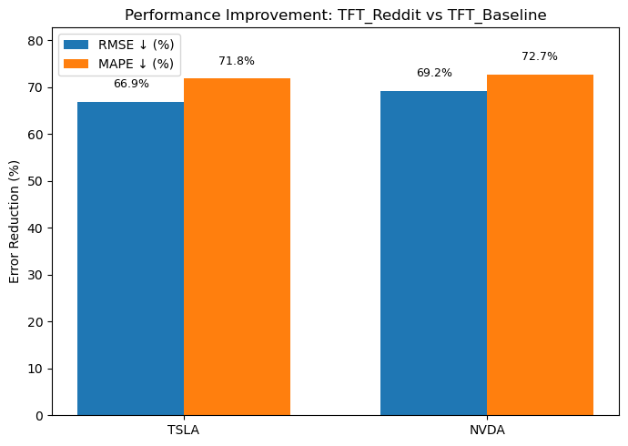

## 📊 Results Visualizations

### Model Forecasts (TSLA)

<table>
<tr>
<td align="center" width="50%">

<br><b>ARIMA</b><br>RMSE: 18.54
</td>
<td align="center" width="50%">

<br><b>TimesFM</b><br>RMSE: 19.80
</td>
</tr>
<tr>
<td align="center" width="50%">

<br><b>Chronos</b><br>RMSE: 8.41
</td>
<td align="center" width="50%">

<br><b>TFT Baseline</b><br>RMSE: 5.45
</td>
</tr>
<tr>
<td align="center" width="50%">

<br><b>TFT with Reddit Sentiment</b><br>RMSE: 3.26 ⭐
</td>
<td align="center" width="50%">
</td>
</tr>
</table>

### Model Forecasts (NVDA)

<table>
<tr>
<td align="center" width="50%">
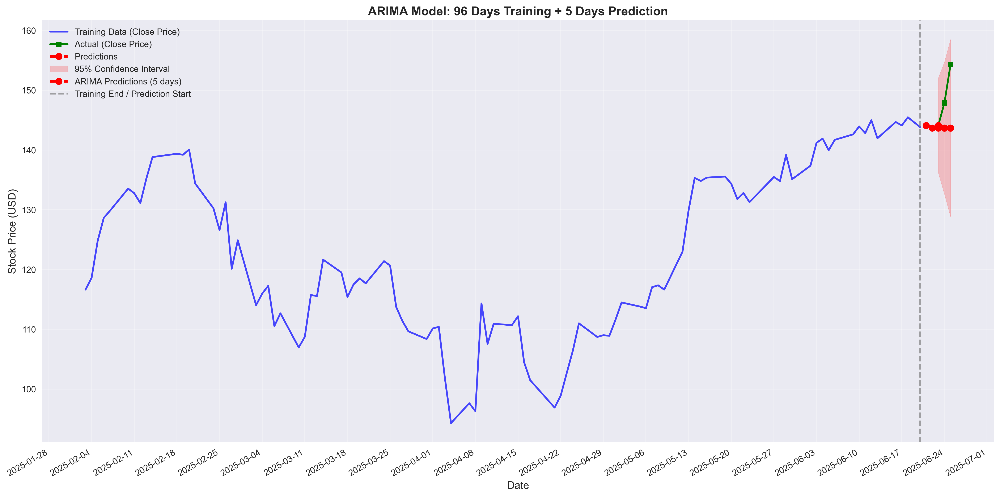
<br><b>ARIMA</b><br>RMSE: 6.61
</td>
<td align="center" width="50%">
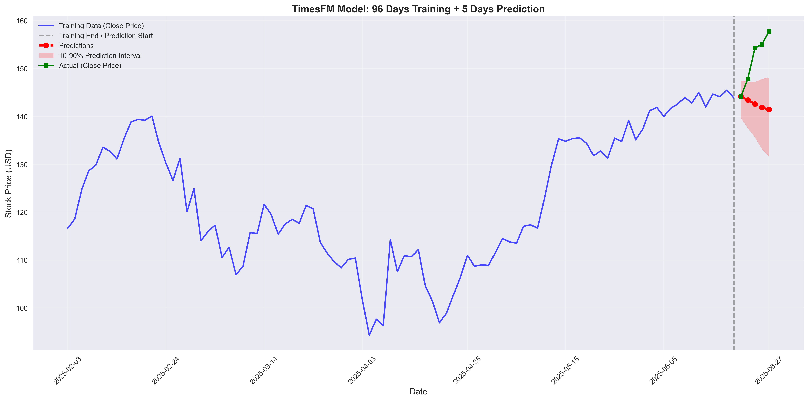
<br><b>TimesFM</b><br>RMSE: 8.26
</td>
</tr>
<tr>
<td align="center" width="50%">
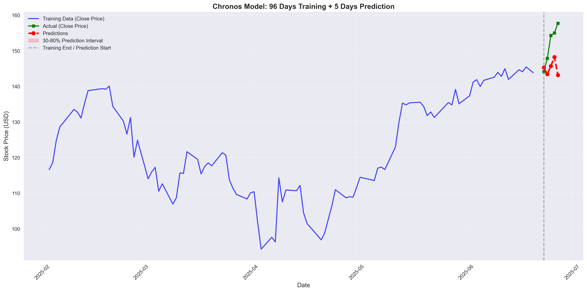
<br><b>Chronos</b><br>RMSE: 8.41
</td>
<td align="center" width="50%">
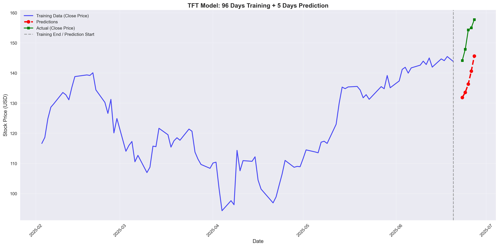
<br><b>TFT Baseline</b><br>RMSE: 14.37
</td>
</tr>
<tr>
<td align="center" width="50%">
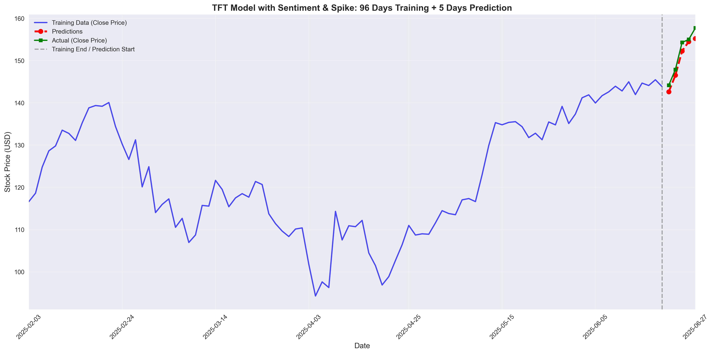
<br><b>TFT with Reddit Sentiment</b><br>RMSE: 1.74 ⭐
</td>
<td align="center" width="50%">
</td>
</tr>
</table>

### TFT Model Interpretability

The Temporal Fusion Transformer (TFT) model provides rich interpretability through attention mechanisms and variable importance analysis. These visualizations help understand how the model makes predictions and which features contribute most to the forecasting performance.

#### TSLA Baseline TFT (Price Features Only)
<table>
<tr>
<td align="center" width="33%">

<br><b>Attention Patterns</b>
</td>
<td align="center" width="33%">

<br><b>Encoder Visualization</b>
</td>
<td align="center" width="33%">
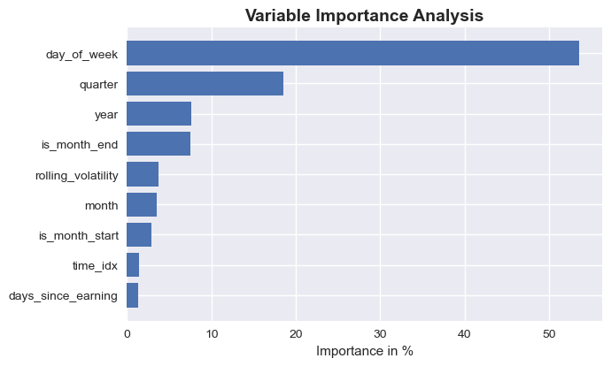
<br><b>Variable Importance</b>
</td>
</tr>
</table>

#### TSLA TFT with Reddit Sentiment
<table>
<tr>
<td align="center" width="33%">

<br><b>Attention Patterns</b>
</td>
<td align="center" width="33%">

<br><b>Encoder Visualization</b>
</td>
<td align="center" width="33%">
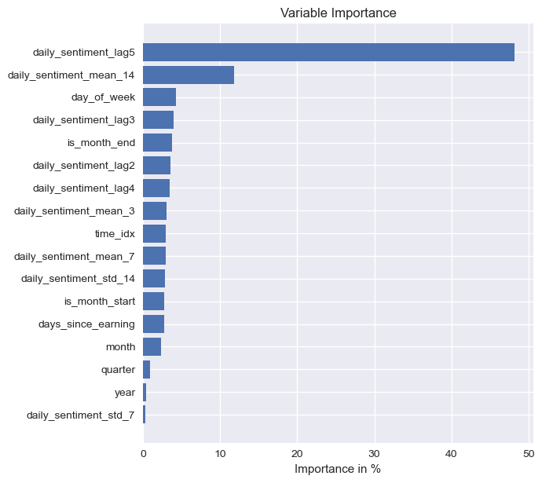
<br><b>Variable Importance</b>
</td>
</tr>
</table>

#### NVDA Baseline TFT (Price Features Only)
<table>
<tr>
<td align="center" width="33%">
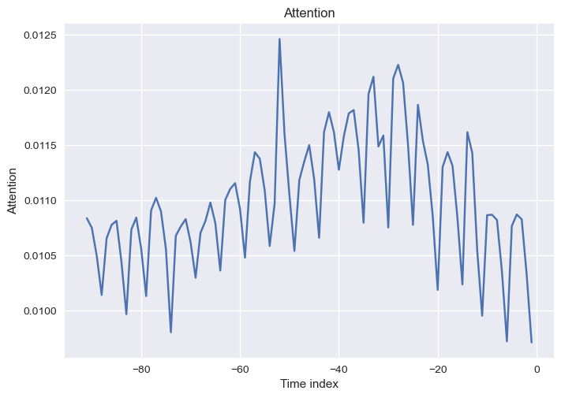
<br><b>Attention Patterns</b>
</td>
<td align="center" width="33%">
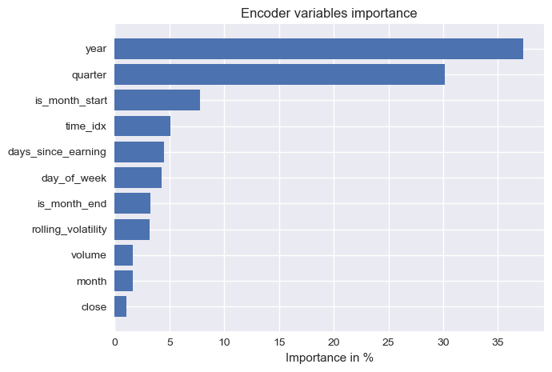
<br><b>Encoder Visualization</b>
</td>
<td align="center" width="33%">
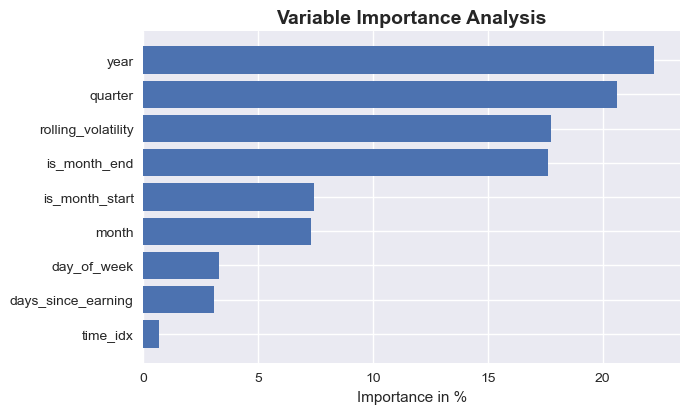
<br><b>Variable Importance</b>
</td>
</tr>
</table>

#### NVDA TFT with Reddit Sentiment
<table>
<tr>
<td align="center" width="33%">
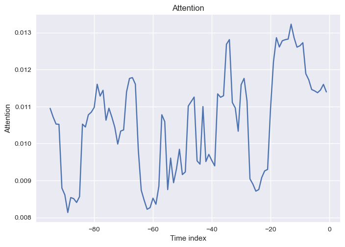
<br><b>Attention Patterns</b>
</td>
<td align="center" width="33%">
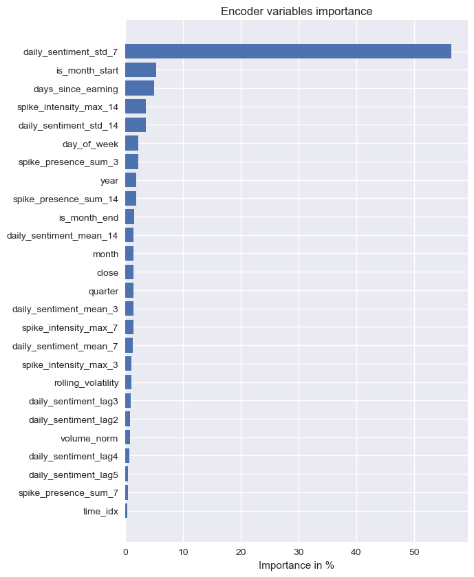
<br><b>Encoder Visualization</b>
</td>
<td align="center" width="33%">
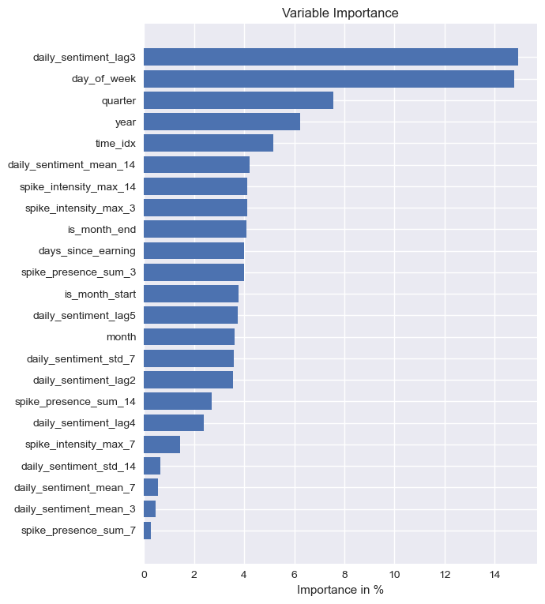
<br><b>Variable Importance</b>
</td>
</tr>
</table>

### Reddit Activity Analysis

#### TSLA Activity Analysis

*Reddit activity spike detection mapped to TSLA price movements*

#### NVDA Activity Analysis
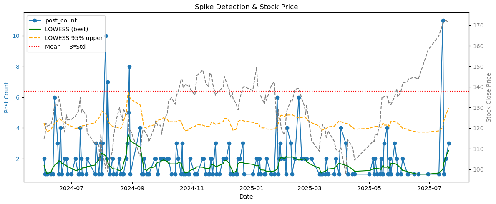
*Reddit activity spike detection mapped to NVDA price movements*

## 🔧 Data Extraction (Optional)

If you want to refresh or expand the datasets, you can run the data extraction pipelines:

### Stock Data Extraction
```bash
python -c "from models.stock_data_extraction import run_stock_data_extraction; run_stock_data_extraction('TSLA')"
```

### Reddit Sentiment Extraction
```bash
python -c "from models.reddit_sentiment import run_reddit_sentiment; \
__import__('datetime'); from datetime import datetime; \
run_reddit_sentiment(subreddit_name='wallstreetbets', start_date=datetime(2024,6,1), end_date=datetime(2025,7,22), max_posts=2000, \
output_csv='data/interim/activitiy_recognition/tesla_sentiment.csv', verbose=True)"
```

### Activity Spike Detection
```bash
python -c "from models.activity_timing import run_activity_timing; \
run_activity_timing(input_csv='data/interim/activitiy_recognition/tesla_sentiment.csv', \
output_csv='data/interim/activitiy_recognition/spike_data.csv', ticker='TSLA', show_plots=True)"
```

## 📁 Project Structure

```
├── checkpoints/                        # Model checkpoints and saved states
├── data/
│   ├── external/                       # External datasets (FinancialPhraseBank)
│   ├── interim/                        # Intermediate artifacts (sentiment, spikes)
│   ├── processed/                      # Feature-engineered datasets
│   └── raw/                           # Raw data files
├── docs/                              # Documentation and diagrams
├── lightning_logs/                    # PyTorch Lightning training logs
├── models/                            # Core model implementations
│   ├── activity_timing.py             # Reddit activity spike detection
│   ├── reddit_*_sentiment.py          # Reddit sentiment extraction (TSLA/NVDA)
│   ├── sentiment_analysis.py          # FinancialPhraseBank benchmark
│   ├── tft_*.py                       # TFT implementations
│   ├── arima*.py                      # ARIMA implementations
│   ├── timesfm*.py                    # TimesFM implementations
│   ├── chronos*.py                    # Chronos implementations
│   └── wordcloud.py                   # Keyword analytics
├── notebooks/                         # Jupyter notebooks for model execution
│   ├── 0_arima_baseline*.ipynb        # ARIMA baselines
│   ├── 1_timesfm_baseline*.ipynb      # TimesFM baselines
│   ├── 2_chronos_baseline*.ipynb      # Chronos baselines
│   ├── 3_tft_baseline_runner*.ipynb   # TFT baselines
│   ├── 4_tft_with_reddit_sentiment_runner*.ipynb # TFT with sentiment
│   ├── 5_volume_normalization_experiment.ipynb
│   ├── 6_neutral_sentiment_ab_test.ipynb
│   └── *_analysis.ipynb               # Analysis notebooks
├── results/                           # Model results and visualizations
│   ├── result_matrix*.csv             # Performance summaries
│   ├── *_forecast.png                 # Forecast visualizations
│   ├── *_Attention.png                # TFT attention patterns
│   ├── *_Encoder.png                  # TFT encoder visualizations
│   ├── *_variable_importance*.png     # Variable importance analysis
│   └── *_activity_timing_spike_price.png # Activity spike detection
├── requirements.txt                   # Python dependencies
├── pyproject.toml                     # Project configuration
└── README.md                          # This file
```

## 📊 Training/Test Windows and Data Files

### TSLA
| Model | Train Window | Test Horizon | Data File |
|-------|-------------|--------------|-----------|
| ARIMA | User-chosen (≈96 rows) | 5 days | `data/TSLA_close.csv` |
| TimesFM | 96 days | 5 days | `data/TSLA_close.csv` |
| Chronos | 96 days | 5 days | `data/TSLA_close.csv` |
| TFT Baseline | 96 days from train_start | 5 days | `data/interim/TSLA_price_full.csv` |
| TFT + Reddit | 96 days from train_start | 5 days | `data/processed/tsla_price_sentiment_spike_merged_20220721_20250915.csv` |

### NVDA
| Model | Train Window | Test Horizon | Data File |
|-------|-------------|--------------|-----------|
| ARIMA | User-chosen (≈96 rows) | 5 days | `data/NVDA_close.csv` |
| TimesFM | 96 days | 5 days | `data/NVDA_close.csv` |
| Chronos | 96 days | 5 days | `data/NVDA_close.csv` |
| TFT Baseline | 96 days from train_start | 5 days | `data/processed/NVDA_price_full.csv` |
| TFT + Reddit | 96 days from train_start | 5 days | `data/processed/nvda_price_sentiment_spike_merged_20250203_20250717.csv` |


## 🧠 Model Interpretability

The Temporal Fusion Transformer (TFT) provides rich interpretability through attention mechanisms and variable importance analysis:

### Key Insights from TFT Results

- **Attention Patterns**: Reddit Sentiment TFT shows more dynamic attention across all time periods compared to baseline TFT
- **Encoder Importance**: Reddit Sentiment TFT heavily focuses on sentiment features (`daily_sentiment_lag5`: 78%, `spike_presence_sum_3`: ~8%)
- **Variable Importance**: Reddit Sentiment TFT shows overwhelming dependence on sentiment volatility (`daily_sentiment_std_14`: 98%)

## 📈 Volume Normalization Experiment

Volume normalization with log1p(volume) + RobustScaler shows modest improvements:

| Model        | RMSE (before) | RMSE (after) | MAPE (before) | MAPE (after) |
|--------------|---------------:|-------------:|--------------:|-------------:|
| TFT_baseline |         10.84  |       10.07  |         3.33  |        3.12  |
| TFT_Reddit   |          4.56  |        4.49  |         1.39  |        0.93  |

## 🎯 Sentiment Benchmark (FinancialPhraseBank)

Model accuracy on FinancialPhraseBank splits (higher is better):

| Dataset                   |  VADER | FinBERT | DistilBERT |
|---------------------------|-------:|--------:|-----------:|
| Sentences_AllAgree.txt    | 0.5707 |  0.9717 |     0.2584 |
| Sentences_75Agree.txt     | 0.5627 |  0.9473 |     0.2667 |
| Sentences_66Agree.txt     | 0.5563 |  0.9182 |     0.2912 |
| Sentences_50Agree.txt     | 0.5429 |  0.8896 |     0.2992 |

**Selected for inference**: **FinBERT** (best across all splits)

## ⚡ Execution Time Performance

| Model                      | TSLA Time (s) | NVDA Time (s) |
|----------------------------|--------------:|--------------:|
| ARIMA                      |         17.49 |          9.84 |
| TimesFM                    |        133.14 |         24.56 |
| Chronos                    |         24.96 |         13.56 |
| TFT_baseline               |         42.19 |         49.90 |
| TFT_with_Reddit_Sentiment  |        443.30 |        216.66 |

## 📋 What is OHLCV?

- **Open**: Period start price
- **High**: Highest price in the period
- **Low**: Lowest price in the period
- **Close**: Period end price
- **Volume**: Traded quantity in the period

The period can be daily, hourly, etc. Some sources also provide Adjusted Close (dividends/splits).

## 📄 License

MIT License — see `LICENSE`.