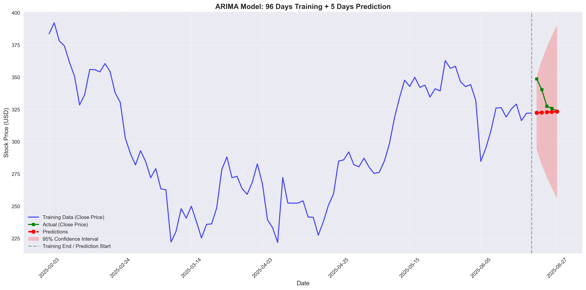
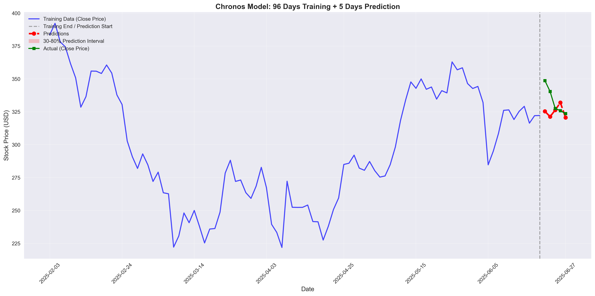
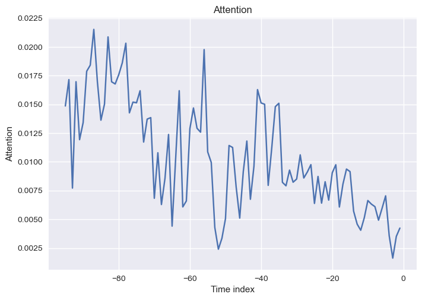
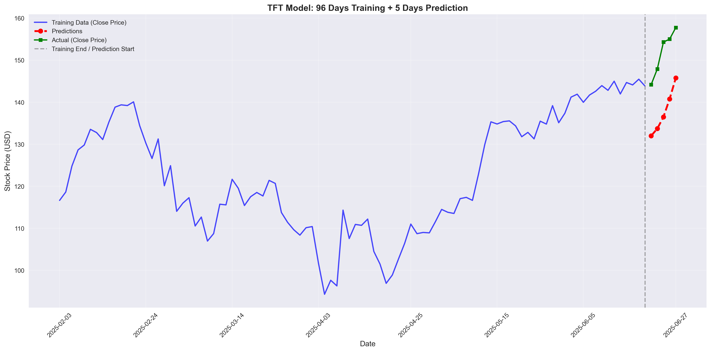
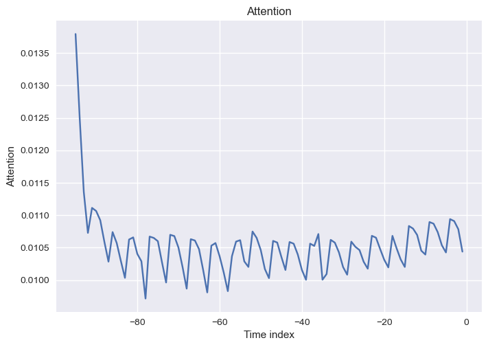
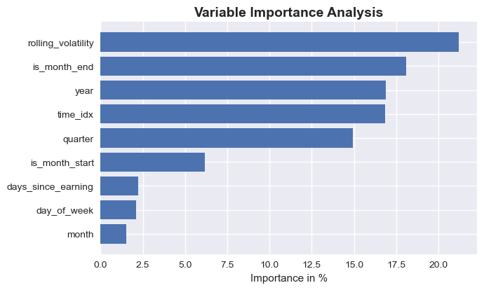
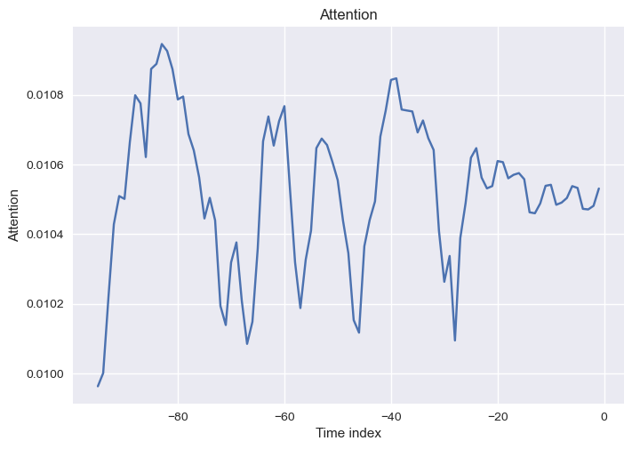
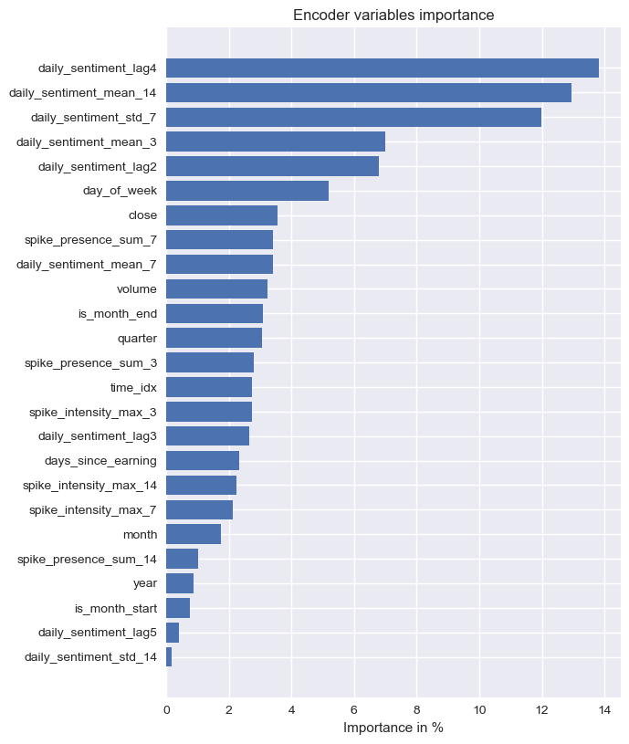
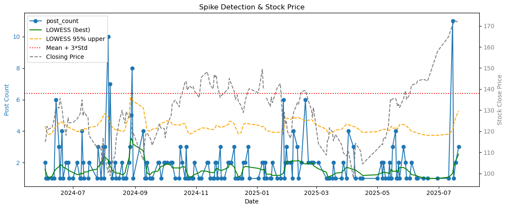

# Financial Time Series Forecasting with Deep Learning and Social Media Sentiment

Clean, reproducible pipelines for forecasting stock prices using ARIMA, Google TimesFM, Amazon Chronos, and Temporal Fusion Transformer (TFT), with optional Reddit sentiment and activity features.

## Quickstart (processed data ready)

### Pipeline overview

Add the following image at `docs/pipeline_overview.png` to render the diagram:


If you already have processed features in `data/processed/` (default repo includes TSLA/AAPL/NVDA), you can skip raw data extraction and run the notebooks directly:

1) Install dependencies
```bash
pip install -r requirements.txt
```

2) Open a notebook under `notebooks/` (e.g., `3_tft_baseline_runner.ipynb` or `4_tft_with_reddit_sentiment_runner.ipynb`)

3) When prompted, enter `training_start_date`

   - Enter a date within the displayed available range (the notebook validates this)
   - Default context window: 96 trading days
   - Default forecast horizon: 5 trading days

4) Run all cells to train and generate the forecast/plots. Results are saved to `results/`.

Data extraction (Reddit, Yahoo Finance API) is optional—only needed if you want to refresh or expand the datasets.

## How to run the code

1) Install dependencies
```bash
pip install -r requirements.txt
```

2) Prepare datasets (optional — notebooks can handle this)
- Prefer notebooks first: `notebooks/stock_data_extraction.ipynb` and `notebooks/reddit_tsla_sentiment_extraction.ipynb` walk you through extraction and feature building end-to-end.
- If you prefer CLI, use the commands below.
- Download historical OHLCV and engineer base features (TSLA default):
```bash
python -c "from models.stock_data_extraction import run_stock_data_extraction; run_stock_data_extraction('TSLA')"
```
- Extract Reddit posts and run FinBERT sentiment, mapped to NYSE trading days (edit dates if needed):
```bash
python -c "from models.reddit_sentiment import run_reddit_sentiment; \
__import__('datetime'); from datetime import datetime; \
run_reddit_sentiment(subreddit_name='wallstreetbets', start_date=datetime(2024,6,1), end_date=datetime(2025,7,22), max_posts=2000, \
output_csv='data/interim/activitiy recognition/tesla_sentiment.csv', verbose=True)"
```
- Detect Reddit activity spikes and export features (also plots):
```bash
python -c "from models.activity_timing import run_activity_timing; \
run_activity_timing(input_csv='data/interim/activitiy recognition/tesla_sentiment.csv', \
output_csv='data/interim/activitiy recognition/spike_data.csv', ticker='TSLA', show_plots=True)"
```

3) Run models via notebooks (recommended order)

**TSLA Models:**
- `notebooks/0_arima_baseline.ipynb`
- `notebooks/1_timesfm_baseline.ipynb`
- `notebooks/2_chronos_baseline.ipynb`
- `notebooks/3_tft_baseline_runner.ipynb`
- `notebooks/4_tft_with_reddit_sentiment_runner.ipynb`

**NVDA Models:**
- `notebooks/0_arima_baseline_nvda.ipynb`
- `notebooks/1_timesfm_baseline_nvda.ipynb`
- `notebooks/2_chronos_baseline_nvda.ipynb`
- `notebooks/3_tft_baseline_runner_nvda.ipynb`
- `notebooks/4_tft_with_reddit_sentiment_runner_nvda.ipynb`

4) Optional analysis notebooks
- `notebooks/activity_timing_spike_detection.ipynb` (delegates to `models/activity_timing.py`)
- `notebooks/wordcloud_analysis.ipynb` (delegates to `models/wordcloud.py`)
- `notebooks/sentiment_analysis.ipynb` (VADER vs FinBERT vs DistilBERT benchmark)

## What is OHLCV?

- Open: period start price
- High: highest price in the period
- Low: lowest price in the period
- Close: period end price
- Volume: traded quantity in the period

The period can be daily, hourly, etc. Some sources also provide Adjusted Close (dividends/splits).

## Top Results

### TSLA Results
Aggregate results on **TSLA** (lower is better), from `results/result_matrix_tsla.csv`:

| Model         |    MAE |     MSE |   RMSE |  MAPE |
|---------------|-------:|--------:|-------:|------:|
| ARIMA         |  18.95 |  371.01 |  19.26 |  6.04 |
| TimesFM       |  23.23 |  583.64 |  24.16 |  7.39 |
| Chronos       |  13.21 |  185.30 |  13.61 |  4.17 |
| TFT_baseline  |   9.86 |  101.50 |  10.07 |  3.12 |
| **TFT_Reddit**|  **2.78** |  **11.12** |  **3.33** |  **0.88** |

- Winner: **TFT_Reddit** (TFT + Reddit sentiment & spike features) with RMSE ≈ 0.47 and MAPE ≈ 0.26%.

### NVDA Results
Aggregate results on **NVDA** (lower is better), from `results/result_matrix_nvda.csv`:

| Model         |    MAE |     MSE |   RMSE |  MAPE |
|---------------|-------:|--------:|-------:|------:|
| ARIMA         |   4.97 |   43.68 |   6.61 |  3.26 |
| TimesFM       |   6.82 |   68.19 |   8.26 |  4.50 |
| Chronos       |   7.10 |   70.67 |   8.41 |  4.59 |
| TFT_baseline  |   1.90 |    3.92 |   1.98 |  1.32 |
| **TFT_Reddit**|  **0.52** |   **0.37** |  **0.61** |  **0.36** |

- Winner: **TFT_Reddit** (TFT + Reddit sentiment & spike features) with RMSE ≈ 0.61 and MAPE ≈ 0.36%.

### Cross-Stock Performance Comparison

| Model         | TSLA RMSE | NVDA RMSE | TSLA MAPE | NVDA MAPE | Performance |
|---------------|----------:|----------:|----------:|----------:|-------------|
| ARIMA         |     19.26 |      6.61 |      6.04 |      3.26 | NVDA better |
| TimesFM       |     24.16 |      8.26 |      7.39 |      4.50 | NVDA better |
| Chronos       |     13.61 |      8.41 |      4.17 |      4.59 | NVDA better |
| TFT_baseline  |     10.07 |      1.98 |      3.12 |      1.32 | NVDA better |
| TFT_Reddit    |      3.33 |      0.61 |      0.88 |      0.36 | NVDA better |

**Key Insights:**
- **TFT_Reddit** achieves exceptional accuracy on both stocks (MAPE < 0.5%)

## 📈 Sentiment-Enhanced TFT Improvement Analysis

This section highlights the **relative performance gain** achieved by integrating Reddit-based sentiment features into the Temporal Fusion Transformer (TFT) architecture.

| Model | TSLA RMSE | ΔRMSE vs Baseline | TSLA MAPE | ΔMAPE vs Baseline | NVDA RMSE | ΔRMSE vs Baseline | NVDA MAPE | ΔMAPE vs Baseline |
|:------|-----------:|------------------:|-----------:|------------------:|-----------:|------------------:|-----------:|------------------:|
| **TFT_baseline** | 10.07 | — | 3.12 | — | 1.98 | — | 1.32 | — |
| **TFT_Reddit** | **3.33** | **−66.9%** | **0.88** | **−71.8%** | **0.61** | **−69.2%** | **0.36** | **−72.7%** |

---

### 📊 Visualizing Performance Improvement

The figure below visualizes the relative error reduction (%) achieved by the sentiment-enhanced TFT (TFT_Reddit) compared to the baseline TFT model.


---

### 🧠 Key Insights

- **Sentiment integration** dramatically reduces forecasting errors for both stocks.  
- For **TSLA**, RMSE ↓ **66.9%**, MAPE ↓ **71.8%** compared to the baseline TFT.  
- For **NVDA**, RMSE ↓ **69.2%**, MAPE ↓ **72.7%**, indicating more stable and accurate forecasts.  
- The improvement demonstrates that **Reddit-derived sentiment embeddings** effectively capture short-term investor mood shifts overlooked by traditional temporal features.

> 🗒️ *Unlike the earlier cross-stock comparison focusing on absolute metrics, this section emphasizes the **relative improvement** within the same model architecture (TFT) achieved through sentiment enhancement.*


### Execution Time (seconds)

Parsed from execution time matrices (lower is faster; values vary by run/hardware):

| Model                      | TSLA Time (s) | NVDA Time (s) |
|----------------------------|--------------:|--------------:|
| ARIMA                      |          6.86 |         14.23 |
| TimesFM                    |         20.48 |         30.04 |
| Chronos                    |          9.72 |         12.91 |
| TFT_baseline               |         33.81 |        133.08 |
| TFT_with_Reddit_Sentiment  |         66.98 |         45.93 |

**Performance Notes:**
- NVDA models generally take longer to train (especially TFT_baseline: 133s vs 34s)
- TFT_with_Reddit_Sentiment is faster on NVDA (46s vs 67s) due to different data characteristics
- ARIMA and Chronos show consistent performance across both stocks

## Results Visualizations

### Model Forecasts (TSLA)

<table>
<tr>
<td align="center" width="50%">

<br><b>ARIMA</b><br>RMSE: 19.26
</td>
<td align="center" width="50%">

<br><b>TimesFM</b><br>RMSE: 24.16
</td>
</tr>
<tr>
<td align="center" width="50%">

<br><b>Chronos</b><br>RMSE: 18.22
</td>
<td align="center" width="50%">

<br><b>TFT Baseline</b><br>RMSE: 10.84
</td>
</tr>
<tr>
<td align="center" width="50%">

<br><b>TFT with Reddit Sentiment</b><br>RMSE: 3.33 ⭐
</td>
<td align="center" width="50%">
</td>
</tr>
</table>

### TFT Model Interpretability

The Temporal Fusion Transformer (TFT) model provides rich interpretability through attention mechanisms and variable importance analysis. These visualizations help understand how the model makes predictions and which features contribute most to the forecasting performance.

**Key Insights from the Results:**

- **Attention Patterns**: Baseline TFT shows concentrated attention on distant past periods (-80 to -60), while Reddit Sentiment TFT displays more dynamic attention across all time periods, indicating that sentiment data helps the model utilize information from various time horizons.

- **Encoder Importance**: Baseline TFT prioritizes temporal features (`is_month_start`: 50%, `day_of_week`: 15%), while Reddit Sentiment TFT heavily focuses on sentiment features (`daily_sentiment_lag5`: 78%, `spike_presence_sum_3`: ~8%), showing sentiment data dominates the encoder's processing.

- **Variable Importance**: Baseline TFT relies on temporal patterns (`is_month_start`: 24%, `year`: 21%), while Reddit Sentiment TFT shows overwhelming dependence on sentiment volatility (`daily_sentiment_std_14`: 98%), indicating that sentiment data's variability is the strongest predictor for stock price movements.

#### TSLA Baseline TFT (Price Features Only)
<table>
<tr>
<td align="center" width="33%">

<br><b>Attention Patterns</b>
</td>
<td align="center" width="33%">

<br><b>Encoder Visualization</b>
</td>
<td align="center" width="33%">

<br><b>Variable Importance</b>
</td>
</tr>
</table>

#### TSLA TFT with Reddit Sentiment
<table>
<tr>
<td align="center" width="33%">

<br><b>Attention Patterns</b>
</td>
<td align="center" width="33%">

<br><b>Encoder Visualization</b>
</td>
<td align="center" width="33%">

<br><b>Variable Importance</b>
</td>
</tr>
</table>

### Model Forecasts (NVDA)

<table>
<tr>
<td align="center" width="50%">

<br><b>ARIMA</b><br>RMSE: 6.61
</td>
<td align="center" width="50%">

<br><b>TimesFM</b><br>RMSE: 8.26
</td>
</tr>
<tr>
<td align="center" width="50%">

<br><b>Chronos</b><br>RMSE: 8.41
</td>
<td align="center" width="50%">

<br><b>TFT Baseline</b><br>RMSE: 1.98
</td>
</tr>
<tr>
<td align="center" width="50%">

<br><b>TFT with Reddit Sentiment</b><br>RMSE: 0.61 ⭐
</td>
<td align="center" width="50%">
</td>
</tr>
</table>

#### NVDA Baseline TFT (Price Features Only)
<table>
<tr>
<td align="center" width="33%">

<br><b>Attention Patterns</b>
</td>
<td align="center" width="33%">

<br><b>Encoder Visualization</b>
</td>
<td align="center" width="33%">

<br><b>Variable Importance</b>
</td>
</tr>
</table>

#### NVDA TFT with Reddit Sentiment
<table>
<tr>
<td align="center" width="33%">

<br><b>Attention Patterns</b>
</td>
<td align="center" width="33%">

<br><b>Encoder Visualization</b>
</td>
<td align="center" width="33%">

<br><b>Variable Importance</b>
</td>
</tr>
</table>

### Reddit Activity Analysis

#### TSLA Activity Analysis

*Reddit activity spike detection mapped to TSLA price movements*

#### NVDA Activity Analysis

*Reddit activity spike detection mapped to NVDA price movements*

## Volume Normalization Experiment (TFT inputs)

We added a log1p(volume) + RobustScaler (fit on the 96-day train window starting 2025-02-01) and used `volume_norm` in TFT runners. Only TFT consumes volume in this project; other models remain univariate on close.


| Model        | RMSE (before) | RMSE (after) | MAPE (before) | MAPE (after) |
|--------------|---------------:|-------------:|--------------:|-------------:|
| TFT_baseline |         10.84  |       10.07  |         3.33  |        3.12  |
| TFT_Reddit   |          4.56  |        4.49  |         1.39  |        0.93  |

- before: `data/processed/tsla_price_sentiment_spike.csv`
- after: `data/processed/tsla_price_sentiment_spike_norm.csv` (preferred if present)
- seed=42, other hyperparameters unchanged.

## Project structure

```
├── data/
│   ├── external/                       # External datasets (e.g., FinancialPhraseBank)
│   ├── interim/                        # Intermediate artifacts (sentiment, spikes)
│   ├── processed/                      # Feature-engineered datasets
│   └── TSLA_close.csv                  # Raw/utility series
├── models/
│   ├── activity_timing.py              # Map Reddit posts to trading days, detect spikes
│   ├── reddit_sentiment.py             # Reddit extraction + FinBERT sentiment
│   ├── sentiment_analysis.py           # FinancialPhraseBank benchmark
│   ├── tft_baseline.py                 # TFT (price-only) runner (notebook recommended)
│   ├── tft_with_reddit_sentiment.py    # TFT with sentiment+spike runner (notebook recommended)
│   ├── arima.py                        # ARIMA baseline
│   ├── timesfm.py                      # Google TimesFM baseline
│   ├── chronos.py                      # Amazon Chronos baseline
│   └── wordcloud.py                    # Wordcloud + keyword analytics
├── notebooks/
│   ├── 0_arima_baseline.ipynb              # TSLA ARIMA baseline
│   ├── 0_arima_baseline_nvda.ipynb         # NVDA ARIMA baseline
│   ├── 1_timesfm_baseline.ipynb            # TSLA TimesFM baseline
│   ├── 1_timesfm_baseline_nvda.ipynb       # NVDA TimesFM baseline
│   ├── 2_chronos_baseline.ipynb            # TSLA Chronos baseline
│   ├── 2_chronos_baseline_nvda.ipynb       # NVDA Chronos baseline
│   ├── 3_tft_baseline_runner.ipynb         # TSLA TFT baseline
│   ├── 3_tft_baseline_runner_nvda.ipynb    # NVDA TFT baseline
│   ├── 4_tft_with_reddit_sentiment_runner.ipynb      # TSLA TFT with sentiment
│   ├── 4_tft_with_reddit_sentiment_runner_nvda.ipynb # NVDA TFT with sentiment
│   ├── activity_timing_spike_detection.ipynb
│   ├── stock_data_extraction.ipynb
│   ├── Reddit_sentiment_extraction.ipynb
│   └── wordcloud_analysis.ipynb
├── results/
│   ├── result_matrix.csv               # TSLA aggregate results summary
│   ├── result_matrix_nvda.csv          # NVDA aggregate results summary
│   ├── sentiment_benchmark_metrics.csv # Sentiment model performance metrics
│   ├── TSLA_results_matrix.pkl         # TSLA persisted performance matrix
│   ├── NVDA_results_matrix.pkl         # NVDA persisted performance matrix
│   ├── TSLA_*_forecast.png             # TSLA model forecast visualizations
│   ├── NVDA_*_forecast.png             # NVDA model forecast visualizations
│   ├── TSLA_TFT_*_Attention.png        # TSLA TFT attention pattern visualizations
│   ├── TSLA_TFT_*_Encoder.png          # TSLA TFT encoder importance plots
│   ├── TSLA_TFT_*_variable_importance_*.png # TSLA TFT variable importance analysis
│   ├── TSLA_activity_timing_spike_price.png # TSLA Reddit activity spike detection
│   └── NVDA_activity_timing_spike_price.png # NVDA Reddit activity spike detection
├── requirements.txt
├── pyproject.toml
└── README.md
```

**Note:** `*` represents wildcard patterns. For example:
- `TSLA_*_forecast.png` includes: `TSLA_ARIMA_forecast.png`, `TSLA_TimesFM_forecast.png`, `TSLA_Chronos_forecast.png`, `TSLA_TFT_baseline_forecast.png`, `TSLA_TFT_with_reddit_sentiment_forecast.png`
- `TSLA_TFT_*_Attention.png` includes: `TSLA_TFT_baseline_Attention.png`, `TSLA_TFT_with_reddit_sentiment_Attention.png`
- `TSLA_TFT_*_variable_importance_*.png` includes all TFT variable importance plots with timestamps

## Notes
- Set your Reddit API keys in `.env` as `REDDIT_CLIENT_ID`, `REDDIT_CLIENT_SECRET`, `REDDIT_USER_AGENT` before running Reddit extraction.
- Paths in notebooks call into the corresponding modules so you can rerun end-to-end quickly.

## Sentiment Benchmark (FinancialPhraseBank)

Model accuracy on FinancialPhraseBank splits (higher is better). Generated by `notebooks/sentiment_analysis.ipynb` and saved to `results/sentiment_benchmark_metrics.csv`.

| Dataset                   |  VADER | FinBERT | DistilBERT |
|---------------------------|-------:|--------:|-----------:|
| Sentences_AllAgree.txt    | 0.5707 |  0.9717 |     0.2584 |
| Sentences_75Agree.txt     | 0.5627 |  0.9473 |     0.2667 |
| Sentences_66Agree.txt     | 0.5563 |  0.9182 |     0.2912 |
| Sentences_50Agree.txt     | 0.5429 |  0.8896 |     0.2992 |

- Selected for inference: **FinBERT** (best across all splits).
- CSV: `results/sentiment_benchmark_metrics.csv` (re-generate by running the notebook end-to-end).


## License
MIT License — see `LICENSE`.